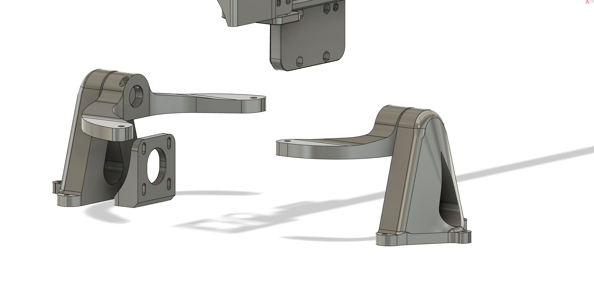

# violin-robot
## [View the website](https://roy-rishi.github.io/project?p=violin-robot)

## image gallery
### electronics
Based on the ATmega2560 microcontroller, this board performs hardware actions requested by a Raspberry Pi single board computer.

### CAD and hardware
These components articulate a real violin as requested by the Raspberry Pi and driven by the above custom board. Screenshots may be incomplete and of varying versions in history.

